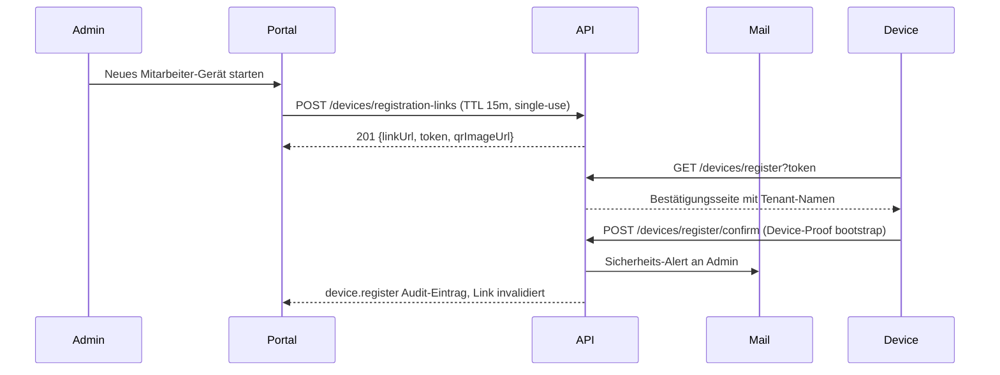
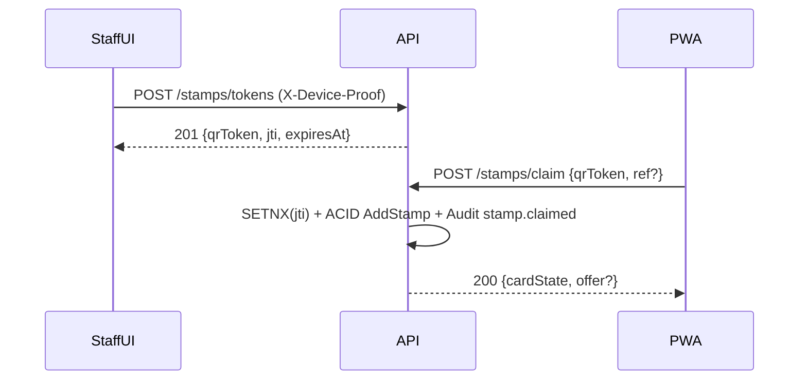
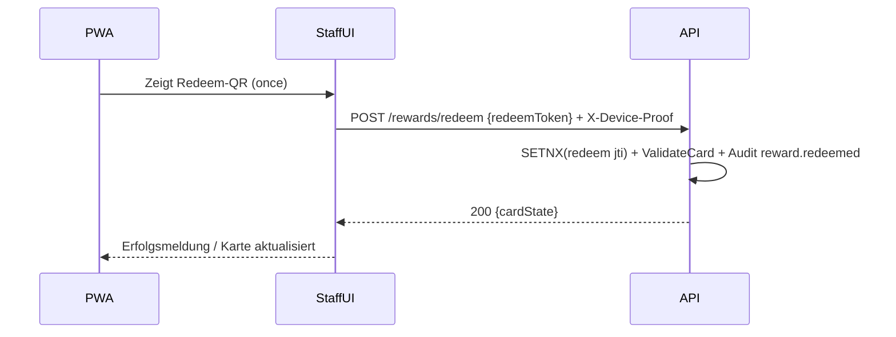
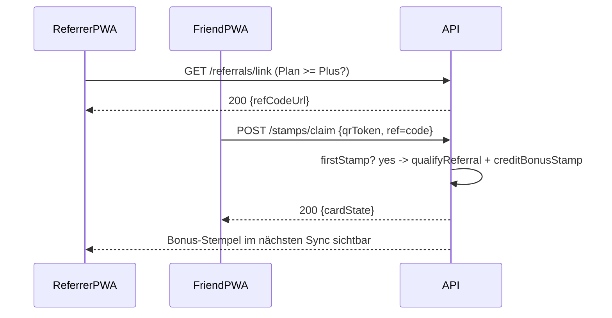

# Kernprozesse: Lokaltreu

Dieses Dokument bildet die vier kritischsten Geschäftsprozesse von Lokaltreu ab. Sie referenzieren die verbindlichen Abläufe aus der Spezifikation ([SPEC §5], [SPEC §15–§16]) sowie die Roadmap-DoDs (Phase 2/3). Alle Sequenzen gehen vom Single-Admin-Modell aus und sind PWA-first gedacht.

---

## 1. Geräte-Onboarding (US-2/US-3)

Kritisch, weil jedes autorisierte Gerät Stempel und Prämien verarbeiten darf. Der Prozess erzwingt TTL=15 Min, Einmaligkeit und Security-Alert.

**Kontrollen**
- Token-Reuse → 409 TOKEN_REUSE, TTL-Expired → 400 TOKEN_EXPIRED.
- Audit: device.register (WORM, 180 Tage), Alert per Mailjet/Brevo.
- Admin kann Gerät anschließend sperren/löschen (UI-Schritt 29 Roadmap).

---

## 2. Stempelvergabe (Ablauf A – /stamps/tokens + /stamps/claim)

Ein Mitarbeitergerät erzeugt einen einmaligen QR-Token; Endkunde scannt per PWA. Anti-Replay via Redis SETNX(jti) und TTL=60 s.

**Kontrollen**
- Rate-Limits: tenant 600 rpm, card 30 rpm.
- Referral-Branch nur bei Plan ≥ Plus aktiv (Starter → 403 PLAN_NOT_ALLOWED).
- Response enthält optionale Angebots-Snippets aus Admin-Dashboard.

---

## 3. Prämieneinlösung (Ablauf B – /rewards/redeem)

Endkunde zeigt Redeem-QR aus der PWA, Mitarbeiter scannt und sendet Redeem-Request.

**Kontrollen**
- Redeem-Token TTL, Einmaligkeit und Mandantenbindung.
- Rate-Limit 10 rpm je Gerät; Idempotency-Key Header erforderlich.
- Audit protokolliert actorType=device, target=cardId.

---

## 4. Referral „Kunden-werben-Kunden“ (US-13/US-14)

Referral-Funktion nur in Plus/Premium-Plänen. Bonus-Stempel wird erst bei validiertem ersten Stempel des geworbenen Kunden vergeben.

**Kontrollen**
- Starter-Plan → 403 PLAN_NOT_ALLOWED (Backend + UI-Toggle disabled).
- Velocity-Limit: max. 5 qualifizierte Referrals pro referrer/Monat.
- Self-Referral blockiert: 422 SELF_REFERRAL_BLOCKED.

---

## Ergänzende Hinweise

- Alle Prozesse erzeugen WORM-Audit-Events (device.register, stamp.token.issued, stamp.claimed, reward.redeemed, referral.*).  
- Error-Handling folgt RFC 7807; correlation_id dient dem Support.  
- Prozesse sind Grundlage für UAT (Roadmap Schritt 12 & 40) und E2E-Tests (Schritt 39).  
- Diagramme dienen auch als Referenz für Runbooks (Replay-Suspected, JWKS-Rotation) und CI-Gates (Anti-Replay, Device-Proof).
